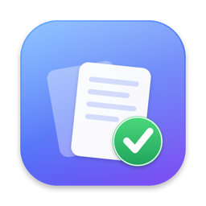
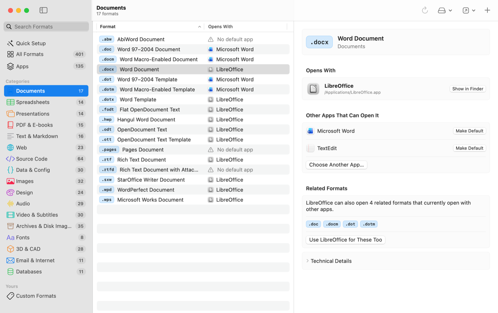
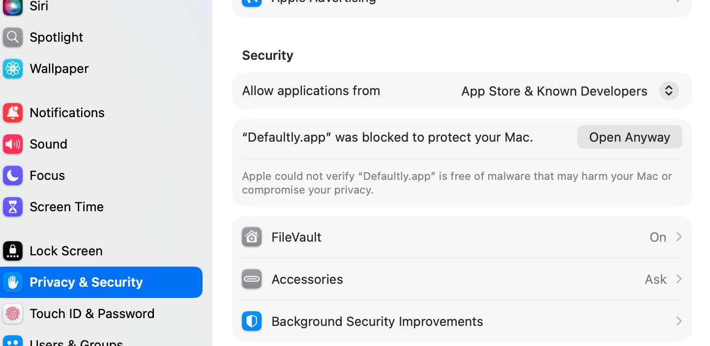
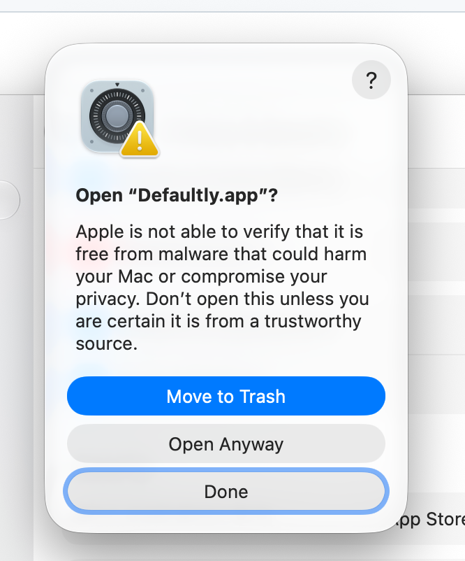

<p align="center">
  
</p>

<h1 align="center">Defaultly</h1>

<p align="center">
  Chọn ứng dụng mở từng loại tệp trên máy Mac của bạn, tập trung tại một nơi.<br>
  SwiftUI nguyên bản · Liquid Glass · English &amp; Tiếng Việt · macOS 14+
</p>

<p align="center">
  <a href="README.md">English</a> · <b>Tiếng Việt</b>
</p>

<p align="center">
  <a href="https://github.com/ndanhkhoi/defaultly/releases/latest"></a>
  <a href="https://github.com/ndanhkhoi/defaultly/actions/workflows/ci.yml"></a>
  
  
</p>

<p align="center">
  <a href="https://unikorn.vn/p/defaultly?ref=defaultly" target="_blank"></a>
</p>

<p align="center">
  
</p>

## Lý do ra đời

Trên macOS, Finder chỉ cho phép đổi ứng dụng mặc định cho từng phần mở rộng một (Get Info → Open With → Change All…), mà không có cái nhìn tổng quan ứng dụng nào đang mở tệp nào. Khi muốn chuyển toàn bộ một nhóm định dạng (mọi tài liệu Office, toàn bộ mã nguồn, tất cả video) sang ứng dụng khác, bạn phải lặp lại thao tác đó hàng chục lần. Các công cụ dòng lệnh thì lại đòi hỏi Homebrew, định danh UTI và bundle ID phức tạp.

Defaultly hiển thị trực quan mọi định dạng, ứng dụng đang mở chúng và những ứng dụng có thể mở được. Bạn có thể đổi một định dạng, một nhóm chọn lọc, hoặc cả một thể loại chỉ trong một bước, xem trước các thay đổi trước khi áp dụng và hoàn tác dễ dàng.

## Tính năng nổi bật

- **Hơn 400 định dạng trong 17 thể loại**: tài liệu, bảng tính, trình chiếu, PDF & sách điện tử, văn bản & Markdown, web, mã nguồn, dữ liệu & cấu hình, hình ảnh, thiết kế, âm thanh, video & phụ đề, tệp nén & ảnh đĩa, phông chữ, 3D & CAD, email & internet, cơ sở dữ liệu.
- **Tùy chỉnh định dạng riêng**: thêm bất kỳ phần mở rộng nào (nhiều phần mở rộng cùng lúc: `kt, kts, gradle`), đặt tên và phân vào một thể loại. Thanh tìm kiếm sẽ gợi ý thêm định dạng mới nếu chưa có trong danh mục.
- **Thiết lập nhanh (Quick Setup)**: chuyển cả một thể loại sang một ứng dụng. Các ứng dụng đã cài đặt được xếp hạng dựa trên số lượng định dạng mà chúng hỗ trợ. Bộ ứng dụng (Microsoft Office, Apple iWork, LibreOffice) cho phép chuyển đổi tài liệu, bảng tính và trình chiếu chỉ trong một thao tác.
- **Gợi ý thông minh (Suggestions)**: chọn một ứng dụng để xem các định dạng nó có thể mở nhưng chưa được gán, bao gồm cả các phần mở rộng khai báo trong `Info.plist` của chính ứng dụng đó. Chọn một định dạng để khám phá các định dạng liên quan có thể dùng chung ứng dụng.
- **Thay đổi an toàn**: mọi thao tác thay đổi hàng loạt đều có bước xem trước (preview). Các định dạng mà ứng dụng không tự khai báo hỗ trợ sẽ mặc định bỏ chọn. Mọi thay đổi đều được đọc lại và kiểm chứng; nếu macOS từ chối, ứng dụng sẽ báo rõ nguyên nhân cùng giải pháp xử lý.
- **Hoàn tác và Làm lại (Undo & Redo)** trực tiếp từ menu Edit (⌘Z / ⇧⌘Z) hoặc từ thông báo xác nhận. **Sao lưu và Khôi phục** toàn bộ liên kết tệp dưới dạng JSON.
- **Toàn diện, không nửa vời**: thiết lập đầy đủ mọi kiểu nội dung (UTI) đằng sau một phần mở rộng (chẳng hạn riêng `.docx` có tới bốn kiểu nội dung), không chỉ gán một kiểu đơn lẻ.
- **Ứng dụng Mac nguyên bản (Native)**: giao diện Liquid Glass chuẩn macOS 26, bố cục thanh bên (sidebar) → bảng (table) → khung kiểm tra (inspector), hỗ trợ đầy đủ phím tắt và VoiceOver. Hỗ trợ song ngữ tiếng Anh và tiếng Việt, chuyển đổi linh hoạt trong Cài đặt.
- **Cập nhật tự động**: Defaultly kiểm tra phiên bản mới trên GitHub mỗi ngày một lần và hiển thị chi tiết thay đổi. **Cài và mở lại** sẽ tự động xác minh gói tải về (checksum SHA-256 và chữ ký mã) rồi thay thế trực tiếp ứng dụng. **Trợ giúp → Ghi chú phát hành** liệt kê lịch sử mọi phiên bản.
- **Bảo mật và riêng tư**: hoàn toàn không thu thập dữ liệu. Kết nối mạng duy nhất là lượt kiểm tra bản cập nhật hàng ngày tới GitHub, bạn có thể tắt tính năng này trong Cài đặt.

## Cài đặt

1. Tải tệp `Defaultly-<version>.dmg` từ [bản phát hành mới nhất](https://github.com/ndanhkhoi/defaultly/releases/latest), mở tệp và kéo **Defaultly** vào thư mục **Applications**.
2. Mở Defaultly lần đầu theo hướng dẫn bên dưới.

Bản dựng Universal hỗ trợ cả Apple silicon và Intel. Bạn có thể xác minh tệp tải về bằng `SHA256SUMS.txt`.

### Lần mở đầu tiên: Cho phép Defaultly trong Cài đặt hệ thống (System Settings)

Defaultly được ký mã ad-hoc (không dùng tài khoản Apple Developer ID trả phí), do đó chưa được Apple công chứng (notarize). Gatekeeper sẽ chặn ứng dụng trong lần mở đầu tiên. Bạn chỉ cần cho phép mở một lần duy nhất; các lần sau ứng dụng sẽ mở bình thường.

**macOS 15 Sequoia trở lên**

1. Mở **Defaultly** từ thư mục Applications. macOS sẽ thông báo không thể xác minh ứng dụng. Nhấp **Xong (Done)**, không chọn *Chuyển vào Thùng rác (Move to Trash)*.
2. Mở **Cài đặt hệ thống (System Settings) → Quyền riêng tư & Bảo mật (Privacy & Security)** và cuộn xuống mục **Bảo mật (Security)**. Bên cạnh thông báo *“Defaultly.app” đã bị chặn để bảo vệ máy Mac của bạn*, nhấp **Vẫn mở (Open Anyway)**.

   

3. macOS sẽ hỏi lại một lần nữa. Nhấp **Vẫn mở (Open Anyway)**, sau đó nhập mật khẩu hoặc dùng Touch ID.

   

**macOS 14 Sonoma:** Giữ phím Control và nhấp chuột (hoặc nhấp chuột phải) vào **Defaultly** trong Applications, chọn **Mở (Open)**, rồi nhấp **Mở (Open)** trong hộp thoại.

**Sử dụng Terminal (mọi phiên bản macOS):** xóa cờ cách ly (quarantine flag) để bỏ qua toàn bộ các bước trên:

```bash
xattr -dr com.apple.quarantine /Applications/Defaultly.app
```

Cảnh báo này là hoàn toàn bình thường đối với các ứng dụng được phân phối không qua Apple Developer ID; đây không phải là phần mềm độc hại. Mọi bản phát hành đều được biên dịch tự động từ mã nguồn của kho lưu trữ này thông qua [GitHub Actions](https://github.com/ndanhkhoi/defaultly/actions/workflows/release.yml), và bạn luôn có thể đối chiếu tệp tải về với mã kiểm tra trong `SHA256SUMS.txt`.

### Cập nhật

Bạn chỉ cần cấp quyền cho Defaultly một lần duy nhất. Sau đó ứng dụng sẽ tự động cập nhật mà macOS không hỏi lại: Gatekeeper chỉ kiểm tra các tệp được đánh dấu là tải về từ trình duyệt internet, còn tệp tải về nội bộ của Defaultly không gắn cờ này. Defaultly 1.0.x chưa tích hợp trình cập nhật nên hãy cài phiên bản mới từ trang Releases một lần. Ứng dụng chỉ cài đặt bản cập nhật khi tệp tải về khớp với `SHA256SUMS.txt` của bản phát hành và chữ ký mã của ứng dụng mới hoàn toàn hợp lệ.

- Defaultly tự động kiểm tra mỗi ngày một lần. Khi có bản mới, ứng dụng sẽ hiển thị ghi chú phát hành cùng các tùy chọn **Cài và mở lại**, **Nhắc tôi sau** và **Bỏ qua phiên bản này**.
- **Defaultly → Kiểm tra cập nhật…** để kiểm tra ngay lập tức.
- **Cài đặt → Cập nhật**: tắt tự động kiểm tra, hoặc cho phép Defaultly tải ngầm bản cập nhật và tự động cài khi bạn thoát ứng dụng.
- Nếu bạn đang chạy Defaultly trực tiếp từ ảnh đĩa (.dmg) hoặc thư mục Tải về (Downloads), hãy chuyển ứng dụng vào thư mục **Applications** trước; nếu không ứng dụng sẽ chuyển hướng mở trang tải về.

Xem thêm lý do tại sao không thể bỏ qua bước xác nhận lần đầu này nếu không có Apple Developer ID trả phí: [docs/code-signing-and-notarization.md](docs/code-signing-and-notarization.md).

## Hướng dẫn sử dụng

| Nhu cầu | Thao tác |
|---------|---------|
| Đổi một định dạng | Chọn định dạng trong thể loại, sau đó chọn ứng dụng trong khung kiểm tra, hoặc nhấp chuột phải → **Mở bằng** |
| Đổi nhiều định dạng | Chọn nhiều dòng (⌘-click, ⇧-click, ⌘A) → **Mở bằng** trên thanh công cụ, hoặc xem các gợi ý trong khung kiểm tra |
| Đổi cả thể loại hoặc bộ ứng dụng | **Thiết lập nhanh** → chọn thể loại hoặc bộ ứng dụng → chọn ứng dụng → **Áp dụng** |
| Khám phá khả năng mở tệp của ứng dụng | **Ứng dụng** → chọn một ứng dụng → đánh dấu các định dạng gợi ý → **Áp dụng** |
| Thêm phần mở rộng tùy chỉnh | Nhấn ⌘N, hoặc gõ tìm kiếm rồi chọn **Thêm … làm định dạng tùy chỉnh** |
| Hoàn tác | Nhấn ⌘Z, hoặc nhấp **Hoàn tác** trên thông báo nổi |
| Sao lưu / Khôi phục | **Tệp → Xuất bản sao lưu…** (⇧⌘E) / **Khôi phục từ bản sao lưu…** (⇧⌘O) |
| Đổi ngôn ngữ | **Defaultly → Cài đặt… → Ngôn ngữ** |
| Cập nhật | **Defaultly → Kiểm tra cập nhật…**; xem chi tiết thay đổi trong **Trợ giúp → Ghi chú phát hành** |

Nếu macOS vẫn giữ ứng dụng cũ cho một định dạng nào đó (thường là định dạng mà một ứng dụng khác "nắm quyền"), Defaultly sẽ yêu cầu macOS xác nhận thông qua API hệ thống. Hãy xác nhận trên hộp thoại thông báo của hệ thống để hoàn tất thay đổi.

## Biên dịch từ mã nguồn

Yêu cầu macOS 14+ cùng Xcode 26 hoặc Command Line Tools với macOS 26 SDK.

```bash
git clone https://github.com/ndanhkhoi/defaultly.git
cd defaultly
make test      # chạy unit test
make run       # biên dịch dist/Defaultly.app và mở ứng dụng
make package   # đóng gói .dmg và .zip universal trong dist/
```

Dự án là một Swift package thuần túy, không dùng project Xcode và không phụ thuộc thư viện ngoài:

- `Sources/DefaultlyCore`: danh mục định dạng, models, trình cập nhật và các dịch vụ trừu tượng hóa qua các protocol (`LaunchServicesClient`, `AppLocating`, `ReleaseSource`), được kiểm thử kỹ lưỡng bằng fakes.
- `Sources/Defaultly`: ứng dụng SwiftUI.
- `scripts/`: kịch bản đóng gói ứng dụng (bundle), package và render biểu tượng icon. `.github/workflows/`: CI và phát hành tự động khi gắn thẻ `v*`.

Xem chi tiết tại [docs/system-architecture.md](docs/system-architecture.md), [docs/code-standards.md](docs/code-standards.md) và [tài liệu đặc tả sản phẩm](docs/project-overview-pdr.md).

## Đóng góp

Chúng tôi luôn hoan nghênh các đóng góp qua issue và pull request. Hãy ghi nhận những thay đổi người dùng nhìn thấy được vào mục **Unreleased** trong [CHANGELOG.md](CHANGELOG.md): các bản phát hành sẽ trích xuất ghi chú từ tệp này. Để bổ sung định dạng hoặc thể loại, hãy chỉnh sửa `Sources/DefaultlyCore/Catalog/FileTypeCatalog.swift` và thêm tên tiếng Việt tương ứng vào `Resources/vi.lproj/Localizable.strings`; lệnh `make test` sẽ tự động kiểm tra tính đầy đủ của cả hai.

## Giấy phép

[MIT](LICENSE)
